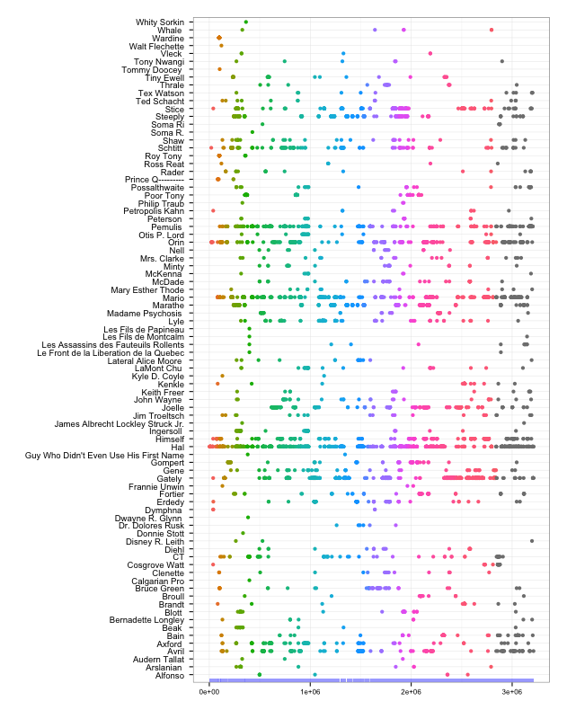
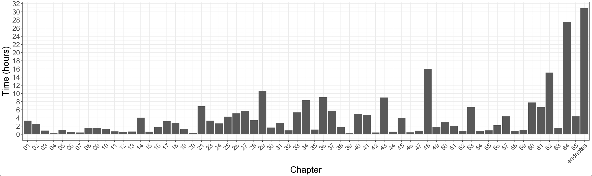

# Infinite Jest

- readme.md
- maintainer: Ciera Martinez @iamciera
- license: [GNU GPL v2.0](http://choosealicense.com/licenses/gpl-2.0/)

## Goals

There are two overarching goals for the project:

1. Learn Python
2. Analyze and visualize text patterns in the book [Infinite Jest by David Foster Wallace](http://en.wikipedia.org/wiki/Infinite_Jest). 

This will be ongoing and most likely never be finished because the goals can never fully be accomplished.

## Directories

1. `data` - Data files organized by type.  Either made directly from text or scraped from the internet
2. `notes` - contain .md files that act as notebook for development for project. 
3. `r` - r scripts
4. `py` - python scripts

# Other

- Date: March 25, 2014
- Language Versions: R: R 3.0.2 GUI 1.62 Snow Leopard build (6558)
- Python: Python 2.7.5, D3: [http://d3js.org/d3.v3.min.js](http://d3js.org/d3.v3.min.js)

# Sample

This a prototype plot for displaying character distribution. Color signifies chapter.

Also, the time it takes for reading the book with an average reading speed of 200 words per minute. 

